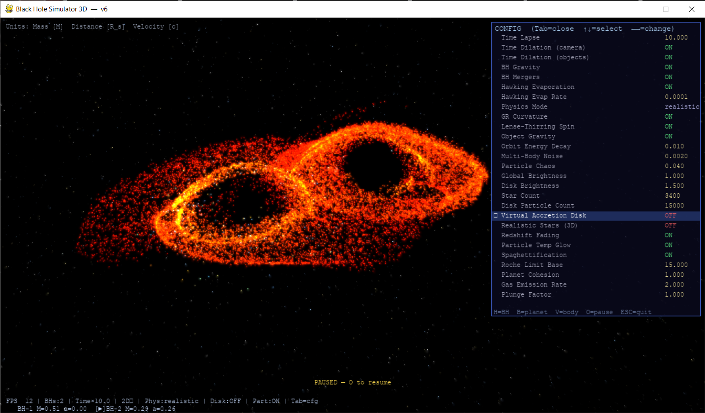

# Black Hole Simulator

A real-time 3D black hole physics simulator built with Python and Pygame, featuring gravitational lensing, accretion disk dynamics, N-body black hole interactions, and tidal disruption events.

---

## Demo

|                                                   |                                                                                     |
| ------------------------------------------------: | ----------------------------------------------------------------------------------- |
|                |                          |
|  |  |

---

## [FAST UPDATE CHECKING HERE](documents\UpdateForV7.md)

## Features

### Black Holes

- **Multiple black holes** with independent mass, spin (Kerr parameter *a*), position and velocity
- **N-body gravitational interaction** using the Paczyński–Wiita pseudo-Newtonian potential
- **Black hole mergers** — momentum conserved, ~5% mass-energy radiated as gravitational waves (Christodoulou formula), spin approximated from angular momentum
- **Hawking evaporation** — mass loss rate ∝ 1/M²
- **Kerr event horizon** radius: r₊ = GM + √(G²M² − a²)
- **Photon sphere**, **ISCO** (prograde Kerr), **shadow radius** all derived per-BH

### Accretion Disk

- Keplerian thin disk with temperature profile T ∝ (r/r_ISCO)^−3/4 (Novikov–Thorne)
- **Doppler shift** — blueshift approaching side, redshift receding side
- **Gravitational redshift** — colors fade toward infrared near the horizon
- **Lense–Thirring precession** (frame dragging) for spinning black holes
- **Photon ring** reconstructed from disk particle angular distribution

### Planet & Body Simulation

- **GasPlanet**: tidal spaghettification, Roche limit disruption, comet-tail debris stream
- **CelestialBody**: hard rocky object, gravitational infall, EH fade
- **Time dilation** for objects near the horizon (Schwarzschild factor)
- Objects accrete into the BH on crossing the event horizon

### Particles

- Free particle system with RK4 integration under multi-BH gravity
- **PARTICLE_FORCE**: optional weak inter-particle gravity (self-gravity, O(N²) branchless)
- **PARTICLE_AUTO_ZOOM**: perspective-correct particle size (size ∝ 1/depth)
- Thermal glow — velocity-dependent color shift toward blue-white
- Absorbed by BH when crossing rs, released when disk is disabled

### Stars & Lensing

- **Realistic 3D star sphere** (80 000 px radius) — stars fixed in world space, rotate with camera
- **Gravitational lensing** of stars and particles using thin-lens deflection angle: δφ = 4GM / (rc²)
- Einstein ring formation when source, BH, and observer are aligned

### Camera

- Free-fly 3D camera with perspective projection
- Mouse drag rotate, WASD move, Space/Ctrl up/down
- **Time dilation on camera** — sim slows down as camera approaches horizon

---

## Controls

### Camera

| Key           | Action                             |
| ------------- | ---------------------------------- |
| Mouse drag    | Rotate                             |
| W / A / S / D | Move forward / left / back / right |
| Space / LCtrl | Move up / down                     |
| LShift        | Speed ×3                          |
| Arrow keys    | Rotate camera                      |

### Black Holes

| Key           | Action                      |
| ------------- | --------------------------- |
| H             | Spawn BH in front of camera |
| `[` / `]` | Cycle selected BH           |
| M / N         | Mass ±0.05 M_geo           |
| K / J         | Spin ±0.05                 |

### Objects

| Key | Action              |
| --- | ------------------- |
| B   | Spawn GasPlanet     |
| V   | Spawn CelestialBody |

### Toggles

| Key     | Action                            |
| ------- | --------------------------------- |
| Tab     | Open / close config panel         |
| O       | Pause / Resume                    |
| Z / X   | Time lapse ±0.5×                |
| P       | Physics mode: realistic ↔ 2-body |
| T       | Camera time dilation ON/OFF       |
| E       | Hawking evaporation ON/OFF        |
| G       | BH gravity ON/OFF                 |
| F       | BH mergers ON/OFF                 |
| Y       | Virtual accretion disk ON/OFF     |
| C       | Free particles visible ON/OFF     |
| R       | Redshift fading ON/OFF            |
| I       | Particle temperature glow ON/OFF  |
| U       | Spaghettification ON/OFF          |
| S       | Realistic 3D stars ON/OFF         |
| ESC / Q | Quit                              |

### Config Panel (Tab)

Navigate with ↑↓, adjust value with ←→.

---

## Installation

```bash
pip install pygame numpy scipy
python main_v7.py
```

Python 3.9+ recommended.

---

## Physics & Algorithms

### Spacetime & Gravity

- **Kerr metric** — event horizon, ISCO, photon sphere computed analytically
- **Paczyński–Wiita potential** — pseudo-Newtonian approximation for N-body BH interactions: V(r) = −GM / (r − r_s)
- **Schwarzschild gravitational redshift**: z = 1 / √(1 − r_s/r)
- **Geodesic integration** — RK4 on the Schwarzschild effective potential for disk particles

### Gravitational Lensing

- **Thin-lens approximation**: θ± = (β ± √(β² + 4θ_E²)) / 2
- Einstein radius: θ_E = √(4GM · D_LS / (c² · D_OS · D_OL))
- Applied to stars, particles, and celestial bodies; produces Einstein rings and double images

### Orbital Mechanics

- **Keplerian angular velocity**: ω = √(GM) · r^−3/2
- **Lense–Thirring frame dragging**: Δω = 2GM·a / r³
- **Novikov–Thorne disk temperature**: T ∝ r^−3/4 · (1 − √(r_ISCO/r))^1/4

### Mergers

- **Christodoulou formula** approximation: M_final = (M₁+M₂) · (1 − 0.0523η), η = M₁M₂/(M₁+M₂)²
- Spin from angular momentum: a_final ≈ (L_1 + L_2 + L_orb) / M_final²

### Spaghettification

- Roche limit tidal disruption: intensity = 1 − r/r_Roche
- Shrink rate ∝ intensity², debris stream inherits orbital tangential velocity (TDE debris stream model)

---

## File Structure

```
main_v7.py       — game loop, input, scene management
blackhole.py     — BlackHoleBody: dynamics, merger, accretion
simulation.py    — AccretionDisk, FreeParticles, CelestialBody, GasPlanet
renderer.py      — numpy framebuffer, lensing, photon ring, bloom
physics.py       — Kerr/Schwarzschild helpers, RK4, Doppler, lensing math
camera.py        — 3D free-fly camera, perspective projection
computer.py      — base physics constants, spline math
config.py        — all tunable parameters + config panel definitions
```

# Thank you for using my Project, pls help me improve it by give me some star or advantage to my social-media (In my profile)

# ',:)
